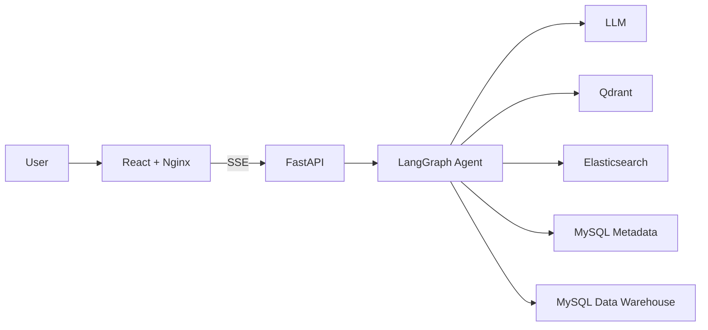

# Shopkeeper Agent Learning

[](https://github.com/Natoanihsin/shoppingkeeper-agent/actions/workflows/ci.yml)

一个用于学习企业级 AI Agent 开发的电商智能问数项目。

用户可以使用自然语言提出业务问题。系统会检索字段、指标和字段值，生成并校验只读 SQL，查询电商数仓，并通过 SSE 实时返回执行进度和最终结果。

## Core Features

- Natural language intent recognition
- Qdrant metadata vector retrieval
- Elasticsearch field value retrieval
- MySQL data warehouse querying
- LangGraph multi-node workflow
- SQL generation, validation and correction
- Read-only SQL security protection
- SSE streaming progress
- Query cancellation by Request ID
- React data table and SQL display
- Docker Compose one-command startup

## Architecture



## Technology Stack

| Layer | Technology |
| --- | --- |
| Frontend | React, TypeScript, Vite, Nginx |
| Backend | FastAPI, Pydantic, SQLAlchemy |
| Agent | LangGraph, LangChain |
| LLM | OpenAI-compatible API |
| Vector Search | Qdrant |
| Full-text Search | Elasticsearch |
| Database | MySQL 8 |
| Embedding | BAAI/bge-small-zh-v1.5 |
| Deployment | Docker, Docker Compose |

## Quick Start

### 1. Prepare configuration

Copy the environment template:

```powershell
Copy-Item .env.example .env
```

Edit `.env` and configure:

```text
LLM_API_KEY=your_real_api_key
HF_CACHE_PATH=C:/Users/your-name/.cache/huggingface
```

Never commit `.env`.

### 2. Start all services

```powershell
docker compose up -d --build
```

Check service status:

```powershell
docker compose ps
```

### 3. Build metadata indexes

Run these commands on the first startup:

```powershell
docker compose exec backend python -m app.scripts.init_qdrant
docker compose exec backend python -m app.scripts.build_meta_vectors
docker compose exec backend python -m app.scripts.init_elasticsearch
docker compose exec backend python -m app.scripts.build_value_index
```

### 4. Open the application

Frontend:

```text
http://localhost:8080
```

FastAPI documentation:

```text
http://localhost:8000/docs
```

## Example Questions

```text
统计总销售额
统计华东地区的销售额
哪个品牌的销售额最高？
按月份统计销售额
黄金会员购买了哪些商品？
```

## API Endpoints

| Method | Path | Description |
| --- | --- | --- |
| GET | `/health` | Backend health check |
| POST | `/query` | Non-streaming query |
| POST | `/query/stream` | SSE streaming query |
| POST | `/query/cancel/{request_id}` | Cancel an active query |

## Agent Workflow

```text
Intent detection
→ Field value recall
→ Keyword extraction
→ Metadata retrieval
→ Parameter extraction
→ SQL generation
→ SQL validation
→ SQL correction when required
→ SQL execution
→ Answer generation
```

The workflow allows a maximum of three SQL validation attempts.

## Security

- The application uses a read-only MySQL account.
- Only single-statement read-only SQL is allowed.
- SQL is parsed and validated using sqlglot.
- Unknown tables and dangerous functions are blocked.
- Query results are limited to 200 rows.
- Database operations have timeout protection.
- Request input is limited to 500 characters.
- Every request receives a Request ID.
- Secrets are stored only in `.env`.

## Local Development

Start the backend:

```powershell
.\.venv\Scripts\Activate.ps1
uvicorn app.main:app --reload
```

Start the frontend:

```powershell
cd frontend
npm install
npm run dev
```

Development frontend:

```text
http://localhost:5173
```

## Tests

Run backend tests:

```powershell
pytest -q
```

Build and type-check the frontend:

```powershell
cd frontend
npm run build
```

## Project Structure

```text
app/
  agent/          LangGraph workflow and nodes
  api/            FastAPI routes and SSE encoding
  clients/        Qdrant, Elasticsearch and embedding clients
  core/           Configuration, logging and Request ID
  db/             MySQL connections
  repositories/   Data access
  security/       SQL security validation
  services/       Business services

docker/
  mysql/          Data warehouse and metadata SQL scripts

frontend/
  src/            React application
  Dockerfile      Frontend production image
  nginx.conf      Static hosting and API proxy

prompts/          LLM prompt templates
tests/            Automated backend tests
```

## Stop Services

```powershell
docker compose down
```

To stop services without deleting persistent volumes, do not add the `-v` option.

## Acknowledgements

This learning project was developed with reference to
[didilili/shopkeeper-agent](https://github.com/didilili/shopkeeper-agent).

The upstream project is licensed under the MIT License.